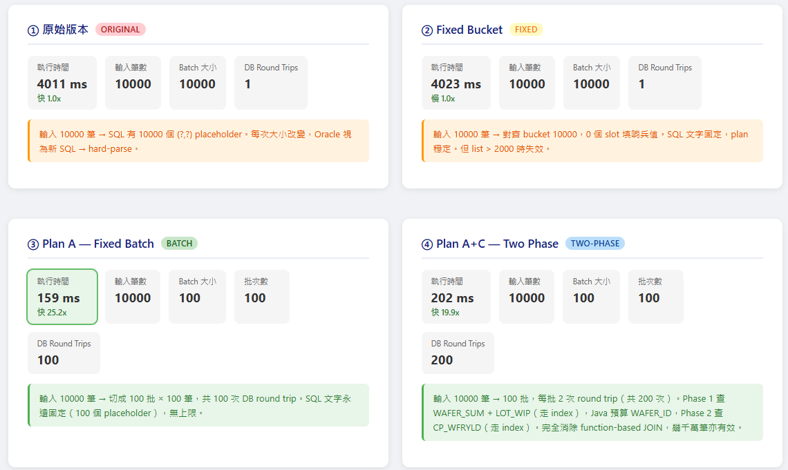

# EnhanceSQL — Oracle SQL Plan 穩定性改善實驗

示範如何透過純 Java 端改寫，解決 Oracle 因 IN 子句參數數量不固定導致 hard-parse、查詢時間不穩定（3 秒 → 30 秒）的問題。



---

## 問題背景

```java
// 原始寫法：每次 list 大小不同，SQL 文字就不同
sb.append("WHERE (Lot_id, Case_Id) IN (");
for (int i = 0; i < caseKeyList.size() - 1; i++) {
    sb.append("(?,?),");
}
sb.append("(?,?))");
```

Oracle 以 **SQL 文字的 hash** 決定是否重用 execution plan。
只要 `(?,?)` 的數量不同，Oracle 就視為全新 SQL，觸發 **hard-parse**，重新計算 execution plan，在 Shared Pool 造成 latch 競爭。

---

## 四種解決方案比較

| 方法 | Plan 穩定 | 幾千萬筆效益 | DB Round Trips | 上限 |
|---|:---:|:---:|:---:|---|
| ① 原始版本 | ✗ | 差 | 1 | 無（每次不同） |
| ② Fixed Bucket | ✓ | 普通 | 1 | 2,000 筆 |
| ③ Plan A — Fixed Batch | ✓ | 普通 | N 批 | 無限 |
| ④ Plan A+C — Two Phase | ✓ | **最佳** | N×2 批 | 無限 |

### ② Fixed Bucket

將 list 大小向上對齊到固定 bucket（1, 2, 4, 8, 16, 32, 64, 128, 256, 512, 1000, 2000），多餘 slot 填入哨兵值 `_DUMMY_LOT_`，使 SQL 文字固定，Oracle plan 可重用。

```
list(5 筆) → bucket 8 → 3 個 slot 填哨兵值 → SQL 文字固定
```

### ③ Plan A — Fixed Batch

每批固定 100 筆（`BATCH_SIZE = 100`），超出的 slot 填哨兵值。
SQL 永遠只有 100 個 `(?,?)` → 只有一種 plan，且無 2,000 筆上限。

```
list(1000 筆) → 10 批 × 100 筆 → 10 次 round trip → Java 合併
```

### ④ Plan A+C — Fixed Batch + Pre-compute WAFER_ID

在 ③ 的基礎上，進一步消除 function-based JOIN：

```sql
-- 原本（幾千萬筆 CP_WFRYLD 無法用 index）
JOIN CP_WFRYLD Y
  ON Y.WAFER_ID = SUBSTR(L.LOT_ID, 1, INSTR(L.LOT_ID, '.'))
                  || SUBSTR(S.WAFER_ID, INSTR(S.WAFER_ID, '.') + 1, 2)
```

改為：

1. **Phase 1**：只查 `WAFER_SUM × LOT_WIP`，走 `(LOT_ID, CASE_ID)` index
2. **Java**：預先計算 `CP_WFRYLD.WAFER_ID = prefix(LOT_ID) + suffix(WAFER_ID)`
3. **Phase 2**：以預算好的 WAFER_ID 直接查 `CP_WFRYLD`，走 `WAFER_ID` index
4. **Java**：JOIN 配對 + SUM 聚合

```java
// computeCpWaferId 實作
// LOT_ID = "LOT00001.W01", WAFER_ID = "W01.01" → "LOT00001.01"
String prefix = lotId.substring(0, lotId.indexOf('.') + 1);
String suffix = waferId.substring(waferId.indexOf('.') + 1, waferId.indexOf('.') + 3);
return prefix + suffix;
```

---

## Oracle Hint 使用指南

Hint 讓你**覆蓋 CBO（Cost-Based Optimizer）的判斷**，加之前必須先確認 CBO 目前做了什麼錯誤決定，不能盲猜。

### Step 1：取得實際執行計畫

```sql
-- 方法一：EXPLAIN PLAN（預估，不實際執行）
EXPLAIN PLAN FOR
SELECT S.Lot_id, S.Case_Id, SUM(...) FROM ...;
SELECT * FROM TABLE(DBMS_XPLAN.DISPLAY(NULL, NULL, 'TYPICAL'));

-- 方法二：GATHER_PLAN_STATISTICS（真實執行，可比對 E-Rows vs A-Rows）
SELECT /*+ GATHER_PLAN_STATISTICS */
    S.Lot_id, S.Case_Id, SUM(...) FROM ...;
SELECT * FROM TABLE(DBMS_XPLAN.DISPLAY_CURSOR(NULL, NULL, 'ALLSTATS LAST'));
```

**重點**：找 E-Rows（預估）vs A-Rows（實際）差距大的步驟，差越多代表 CBO 越誤判，那裡就最需要 hint。

### Step 2：三個關鍵決策點

#### 決策一：JOIN 順序

最佳順序：先用 IN 子句過濾 `WAFER_SUM`（結果集最小），再 join 小表 `LOT_WIP`，最後才碰大表 `CP_WFRYLD`。

```sql
SELECT /*+ LEADING(S L Y) */ ...
```

#### 決策二：JOIN 方法

| 情境 | 適合 Hint |
|---|---|
| 驅動表結果集小，被 join 表有 index | `USE_NL(L)` / `USE_NL(Y)` |
| 兩表都很大，沒有好 index | `USE_HASH(Y)` |
| 有排序需求（ORDER BY） | `USE_MERGE(Y)` |

```sql
SELECT /*+ LEADING(S L Y) USE_NL(L) USE_NL(Y) */ ...
```

#### 決策三：Index 使用

若 CBO 選擇 Full Table Scan 而 index 確實存在：

```sql
-- 指定 index 名稱
SELECT /*+ INDEX(S idx_wafer_sum_lot_case) INDEX(Y idx_cp_wfryld_wafer_id) */ ...

-- 只指定表，讓 Oracle 選哪個 index
SELECT /*+ INDEX(S) INDEX(Y) */ ...
```

### Step 3：其他常用 Hint

| Hint | 用途 | 適用時機 |
|---|---|---|
| `RESULT_CACHE` | 快取整個查詢結果 | 相同 key 會重複查詢 |
| `PARALLEL(S 4)` | 平行掃描 | 一次撈很大量資料 |
| `NO_MERGE` | 阻止 subquery 被展開 | 展開後 plan 反而變差 |
| `CARDINALITY(S 100)` | 直接告訴 CBO 預估筆數 | 統計資訊嚴重失準 |

### Step 4：判斷要不要加 Hint

```
執行計畫 E-Rows vs A-Rows 差 10 倍以上？
  ├── 是 → 先請 DBA 跑 DBMS_STATS.GATHER_TABLE_STATS 更新統計資訊
  │         若更新後仍然差 → 才加 Hint 強制指定
  └── 否 → 不需要 hint，問題在別的地方（index 缺失、SQL 寫法、lock）
```

> **注意**：Hint 寫死在 SQL 裡，資料量或 index 結構改變後可能變成拖累，需定期 review。

### 在本專案設定 Hint

在 `backend/src/main/resources/application.properties` 修改：

```properties
# 留空 = 不加 hint（預設）
query.hint=

# 範例：強制 JOIN 順序 + NL join + 走 index
query.hint=LEADING(S L Y) USE_NL(L) USE_NL(Y) INDEX(S) INDEX(Y)

# 範例：大表改用 Hash Join
query.hint=LEADING(S L Y) USE_HASH(Y) INDEX(S)
```

Hint 會自動套用到方法一～三的主查詢（`SELECT /*+ ... */ ...`），重啟後端即生效。

---

## 技術架構

```
EnhanceSQL/
├── backend/                          # Spring Boot 3 + Java 17
│   ├── pom.xml
│   └── src/main/
│       ├── java/com/example/enhancesql/
│       │   ├── Application.java
│       │   ├── config/WebConfig.java         # CORS
│       │   ├── controller/CaseController.java # REST endpoints
│       │   ├── model/                         # DTO
│       │   └── repository/CaseRepository.java # 四種查詢邏輯
│       └── resources/
│           ├── application.properties
│           ├── schema.sql                     # 建表
│           └── data.sql                       # 10,000 筆測試資料
└── frontend/                         # Angular 15
    └── src/app/
        ├── components/query-panel/    # 主操作介面
        ├── components/result-table/   # 結果元件
        └── services/case.service.ts  # HTTP 封裝
```

### REST API

| Method | Endpoint | 說明 |
|---|---|---|
| POST | `/api/query/original` | 原始版本 |
| POST | `/api/query/fixed` | Fixed Bucket |
| POST | `/api/query/batch` | Plan A — Fixed Batch |
| POST | `/api/query/two-phase` | Plan A+C — Two Phase |

**Request body：**
```json
{
  "sortNo": 1,
  "cases": [
    { "lotId": "LOT00001.W01", "caseId": "CASE_00001" }
  ]
}
```

**Response：**
```json
{
  "mode": "two-phase",
  "executionTimeMs": 42,
  "inputSize": 1000,
  "bucketSize": 100,
  "batchCount": 10,
  "dbRoundTrips": 20,
  "note": "...",
  "results": [...]
}
```

---

## 測試資料

H2 in-memory database，啟動時自動建立：

| 表格 | 筆數 | 說明 |
|---|---|---|
| `WAFER_SUM` | 10,000 | 每 20 筆有 1 筆 `WAIVE_INSP_FLAG='Y'`（被過濾） |
| `LOT_WIP` | 10,000 | TYPE_FLAG 奇偶交替 A/B |
| `CP_WFRYLD` | 10,000 | END_TEST_TIME 用質數倍數分散 |

LOT 編號格式：`LOT00001.W01` ～ `LOT10000.W01`

---

## 啟動方式

### 後端（Spring Boot 3 + H2）

```bash
cd backend
mvn spring-boot:run
# http://localhost:8080/enhancesql/api
# H2 Console: http://localhost:8080/enhancesql/h2-console
```

### 前端（Angular 15）

```bash
cd frontend
npm install
npm start
# http://localhost:4200
```

---

## 環境需求

| 項目 | 版本 |
|---|---|
| Java | 17+ |
| Maven | 3.8+ |
| Node.js | 16+ |
| npm | 8+ |
